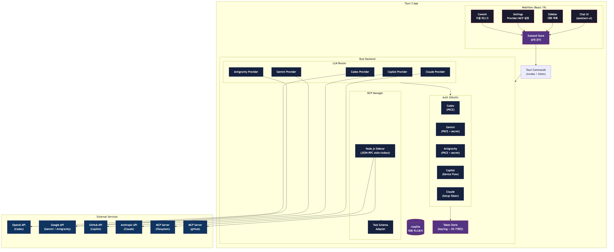
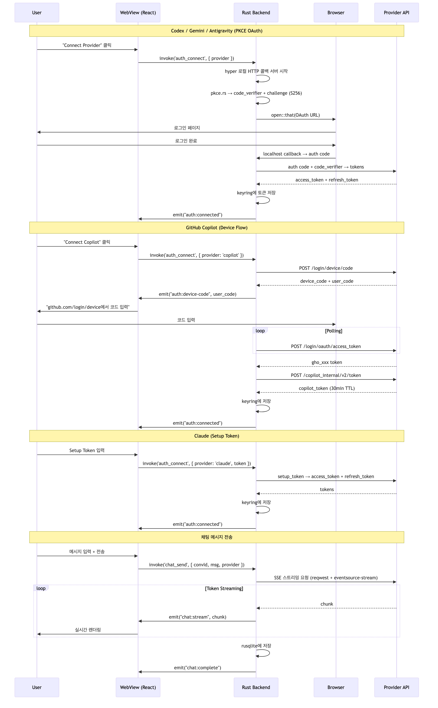

# Kangnam Client - 설계 문서

## 1. 목적

ChatGPT Desktop / Claude Desktop과 유사한 데스크탑 LLM 채팅 클라이언트.
구독 기반 provider(API Key 없이 OAuth로 인증)를 통합하고, MCP 서버 연결을 지원한다.

**성공 기준**:
- 5개 provider(Codex, Gemini, Antigravity, Copilot, Claude)에 OAuth 인증 후 스트리밍 채팅이 가능하다
- MCP 서버를 연결하여 tool calling이 동작한다
- 대화 히스토리가 로컬 SQLite에 저장/복원된다
- 앱 크기 65MB 이하, RAM 50MB 이하

### 지원 Provider

| Provider | 인증 방식 | client_id | API Endpoint |
|---|---|---|---|
| OpenAI Codex | PKCE OAuth (localhost:1455) | `app_EMoamEEZ73f0CkXaXp7hrann` | `chatgpt.com/backend-api/codex/responses` |
| Gemini CLI | PKCE + secret (dynamic port) | `681255809395-...` | `cloudcode-pa.googleapis.com/v1internal` |
| Antigravity | PKCE + secret (localhost:51121) | `1071006060591-...` | same endpoint, extra scopes (cclog, experimentsandconfigs) |
| GitHub Copilot | Device Flow | `Iv1.b507a08c87ecfe98` | `api.githubcopilot.com/chat/completions` |
| Claude | OAuth (Setup Token) | `9d1c250a-...` | `platform.claude.com` |

### 핵심 기능

- 다중 Provider 통합 채팅 (provider/model 전환 가능)
- MCP 서버 연결 (tool calling + 시각화)
- 스트리밍 응답 + 마크다운/코드/LaTeX 렌더링
- Cowork 모드 (자율적 멀티스텝 태스크 실행)
- 스킬/프롬프트 시스템 (시스템 프롬프트 관리 + AI 생성)
- Eval 워크벤치 (스킬 평가 + 최적화)
- 대화 히스토리 관리 + 검색
- Context Window 관리 (토큰 추정 + 자동 압축)
- 시스템 트레이 + 윈도우 상태 저장

---

## 2. 기술 스택

```
Desktop Shell:    Tauri 2 (Rust backend + 시스템 WebView)
Frontend:         React 19 + Vite 7
Chat UI:          @assistant-ui/react (스트리밍, 마크다운, 도구 호출 렌더링)
Styling:          Tailwind CSS v4
State:            Zustand 5 (통합 단일 스토어)
Markdown:         @assistant-ui/react-markdown + Shiki 코드 하이라이팅 + KaTeX LaTeX
MCP:              Node.js 사이드카 (@modelcontextprotocol/sdk v1.27.1)
DB (로컬):        rusqlite (네이티브 SQLite, bundled)
Token 저장:       keyring (OS 키체인 — macOS Keychain, Windows Credential Manager)
HTTP:             reqwest + eventsource-stream (SSE 스트리밍)
Language:         Rust (backend) + TypeScript (frontend)
```

### 기술 결정 근거

| 결정 | 채택 방안 | 기각 대안 | 기각 이유 |
|---|---|---|---|
| Desktop framework | Tauri 2 | Electron | Electron 200MB+/300MB RAM → Tauri 15MB/30MB RAM. 시스템 WebView 사용으로 크기/메모리 대폭 감소 |
| UI framework | React 19 | Svelte/Vue | assistant-ui(유일한 프로덕션급 LLM 채팅 라이브러리)가 React 전용 |
| Chat UI | @assistant-ui/react | 직접 구현 | 스트리밍 마크다운, 코드 하이라이팅, 도구 호출 렌더링 내장. 8.8k stars, YC-backed |
| DB | rusqlite (bundled) | sql.js (WASM) | 네이티브 SQLite가 WASM보다 빠르고 안정적. Rust에서 직접 사용 |
| MCP 구현 | Node.js 사이드카 | Rust 재구현 | @modelcontextprotocol/sdk의 stdio/JSON-RPC/transport 복잡도 높음. 재구현 시 2-3주 추가 |
| Token 저장 | keyring (OS 키체인) | 파일 암호화 | OS 수준 보안, 크로스플랫폼 (macOS Keychain, Windows Credential Manager, Linux Secret Service) |
| 사이드카 번들 | Bun compile | pkg (Node.js) | Bun ~15MB vs pkg ~50MB. 크로스 컴파일 지원 |

---

## 3. 아키텍처



> Mermaid 원본: [`architecture.mmd`](./architecture.mmd)

---

## 4. Provider별 인증 플로우



> Mermaid 원본: [`auth-flow.mmd`](./auth-flow.mmd)

### 4.1 공통 인증 구조 (Rust)

모든 Provider의 OAuth 흐름은 `src-tauri/src/auth/` 모듈에서 관리한다.
인증 콜백은 hyper 기반 로컬 HTTP 서버(`oauth_server.rs`)로 수신하며, PKCE는 `pkce.rs`에서 생성한다.

```
src-tauri/src/auth/
├── mod.rs            # Auth 모듈 진입점
├── pkce.rs           # PKCE code_verifier/challenge 생성 (SHA-256)
├── oauth_server.rs   # hyper 기반 로컬 HTTP 콜백 서버
├── token_store.rs    # keyring 기반 크로스플랫폼 토큰 저장
└── providers.rs      # Codex, Gemini, Antigravity, Copilot, Claude OAuth 설정
```

### 4.2 OpenAI Codex (PKCE OAuth)

1. 사용자 "Connect OpenAI" 클릭
2. Rust → localhost:1455에서 hyper HTTP 콜백 서버 시작
3. `pkce.rs` → code_verifier + code_challenge(S256) 생성
4. `open::that()` → 시스템 브라우저에서 OpenAI OAuth URL 열기
5. 브라우저에서 ChatGPT 로그인
6. OAuth 콜백 → `http://localhost:1455/auth/callback` → auth code 수신
7. auth code + code_verifier → token endpoint → access_token + refresh_token
8. `keyring::Entry` → OS 키체인에 암호화 저장
9. 토큰 만료 시 자동 refresh

### 4.3 Gemini CLI (PKCE + client_secret)

1. 사용자 "Connect Gemini" 클릭
2. Rust → 동적 포트에서 HTTP 콜백 서버 시작
3. PKCE 생성 + Google OAuth URL 열기
   - scopes: cloud-platform, userinfo.email, userinfo.profile
4. OAuth 콜백 → auth code 수신
5. auth code + code_verifier + client_secret → tokens
6. 저장 + 자동 갱신

### 4.4 Antigravity (PKCE + client_secret)

- Gemini와 동일한 Google OAuth 흐름
- 고정 포트: localhost:51121, 경로: /oauth-callback
- 추가 scopes: cclog, experimentsandconfigs
- 사용 가능 모델: Gemini 3 Pro/Flash + Claude Sonnet/Opus 4.6

### 4.5 GitHub Copilot (Device Flow)

1. 사용자 "Connect Copilot" 클릭
2. Rust → POST `github.com/login/device/code` (VSCode client_id)
3. user_code 수신 → 프론트엔드에 표시
4. 사용자 → `github.com/login/device` 방문 → 코드 입력
5. Rust가 polling → `gho_xxx` OAuth token 수신
6. `gho_xxx` → POST `api.github.com/copilot_internal/v2/token` → Copilot token (30분 TTL)
7. Copilot token으로 API 호출, 30분마다 자동 갱신

### 4.6 Claude (Setup Token)

1. 사용자가 Claude Max 구독의 Setup Token을 입력
2. Setup Token → token endpoint → access_token + refresh_token
3. 저장 + 자동 갱신

---

## 5. 데이터 흐름

### 5.1 메시지 전송 흐름

1. 사용자가 프론트엔드의 입력창에 메시지 작성
2. 프론트엔드 → `invoke('chat_send', { conversationId, message, provider, model })` → Rust
3. Rust의 `commands::chat::chat_send` → LLM Provider로 라우팅
4. Provider → 해당 API에 SSE 스트리밍 요청 (`reqwest` + `eventsource-stream`)
5. 스트리밍 chunk → `window.emit("chat:stream", ...)` → 프론트엔드에 실시간 전달
6. 프론트엔드의 `@assistant-ui/react`가 스트리밍 마크다운 렌더링
7. 완료 시 Rust가 rusqlite에 대화 저장
8. `window.emit("chat:complete", ...)` → 프론트엔드에 완료 알림

### 5.2 MCP Tool Call 흐름

1. LLM 응답에 `tool_use` stop reason 포함
2. Rust의 Agent Loop에서 tool call 감지
3. MCP 사이드카에 JSON-RPC 요청 (stdin/stdout)
4. 사이드카의 `@modelcontextprotocol/sdk`가 실제 MCP 서버에 요청
5. Tool 결과를 LLM에 전달 → 다음 응답 생성
6. `stop_reason === 'end_turn'`까지 반복
7. 각 tool call의 이름, 인자, 결과가 DB에 저장되고 UI에 시각화

### 5.3 Cowork 태스크 흐름

1. 사용자가 Cowork 탭에서 태스크 입력
2. `invoke('cowork_start', { task, provider, model })` → Rust
3. 시스템 프롬프트로 "계획 수립 → 자율 실행" 모드 지시
4. LLM이 계획 생성 → `emit("cowork:plan", ...)` → 프론트엔드에 계획 표시
5. 각 스텝 실행 (MCP 도구 호출 포함) → 실시간 진행상황 전송
6. 태스크 완료 시 `emit("cowork:complete", ...)` → 요약 표시

---

## 6. API 설계 (Tauri Commands)

### Tauri invoke/listen API

```rust
// === Auth ===
#[tauri::command] auth_connect(provider: String)
#[tauri::command] auth_disconnect(provider: String)
#[tauri::command] auth_status() -> Vec<AuthStatus>

// === Chat ===
#[tauri::command] chat_send(conversation_id, message, provider, model, ...)
#[tauri::command] chat_stop()
// Events: "chat:stream", "chat:tool-call", "chat:complete", "chat:error"

// === Conversations ===
#[tauri::command] conv_list() -> Vec<Conversation>
#[tauri::command] conv_create(provider) -> Conversation
#[tauri::command] conv_delete(id)
#[tauri::command] conv_get_messages(id) -> Vec<Message>
#[tauri::command] conv_update_title(id, title)
#[tauri::command] conv_toggle_pin(id)
#[tauri::command] conv_delete_all()
#[tauri::command] conv_export(id) -> String
#[tauri::command] conv_search(query) -> Vec<SearchResult>

// === Cowork ===
#[tauri::command] cowork_start(task, provider, model)
#[tauri::command] cowork_stop()
#[tauri::command] cowork_follow_up(instruction)
// Events: "cowork:plan", "cowork:stream", "cowork:tool-call", "cowork:complete"

// === MCP ===
#[tauri::command] mcp_list_servers() -> Vec<ServerConfig>
#[tauri::command] mcp_add_server(config)
#[tauri::command] mcp_reconnect_server(name)
#[tauri::command] mcp_update_server(name, config)
#[tauri::command] mcp_remove_server(name)
#[tauri::command] mcp_list_tools() -> Vec<Tool>
#[tauri::command] mcp_server_status() -> Vec<ServerStatus>
#[tauri::command] mcp_get_config() -> Value
#[tauri::command] mcp_ai_assist(input, provider, model) -> String

// === Skills/Prompts ===
#[tauri::command] prompts_list() -> Vec<Prompt>
#[tauri::command] prompts_get(id) -> Prompt
#[tauri::command] prompts_get_instructions(id) -> String
#[tauri::command] prompts_create(title, content, ...)
#[tauri::command] prompts_update(id, title, content, ...)
#[tauri::command] prompts_delete(id)
#[tauri::command] prompts_ref_list/add/update/delete(...)

// === Skills AI ===
#[tauri::command] prompts_ai_generate/improve/generate_ref/generate_evals/grade/compare/analyze(...)

// === Eval ===
#[tauri::command] eval_set_create/list/delete(...)
#[tauri::command] eval_case_add/bulk_add/update/delete/list(...)
#[tauri::command] eval_run_start/stop/list/get/results/stats/delete(...)
#[tauri::command] eval_result_feedback(...)
#[tauri::command] eval_ai_generate(...)
#[tauri::command] eval_optimize_start(...)

// === Settings ===
#[tauri::command] settings_get() -> Settings
#[tauri::command] settings_set(settings)
```

---

## 7. DB 스키마 (rusqlite)

```sql
-- 대화
CREATE TABLE conversations (
  id          TEXT PRIMARY KEY,
  title       TEXT NOT NULL DEFAULT 'New Chat',
  provider    TEXT NOT NULL,
  model       TEXT,
  pinned      INTEGER NOT NULL DEFAULT 0,
  created_at  INTEGER NOT NULL DEFAULT (strftime('%s', 'now')),
  updated_at  INTEGER NOT NULL DEFAULT (strftime('%s', 'now'))
);

-- 메시지
CREATE TABLE messages (
  id              TEXT PRIMARY KEY,
  conversation_id TEXT NOT NULL REFERENCES conversations(id) ON DELETE CASCADE,
  role            TEXT NOT NULL,
  content         TEXT NOT NULL,
  tool_use_id     TEXT,
  tool_name       TEXT,
  tool_args       TEXT,
  token_count     INTEGER,
  attachments     TEXT,
  created_at      INTEGER NOT NULL DEFAULT (strftime('%s', 'now'))
);

CREATE INDEX idx_messages_conv ON messages(conversation_id, created_at);

-- 인증 토큰 (keyring에 저장, DB는 메타데이터만)
CREATE TABLE auth_tokens (
  provider      TEXT PRIMARY KEY,
  expires_at    INTEGER,
  metadata      TEXT
);

-- MCP 서버 설정
CREATE TABLE mcp_servers (
  name     TEXT PRIMARY KEY,
  type     TEXT NOT NULL,
  command  TEXT,
  args     TEXT,
  url      TEXT,
  env      TEXT,
  headers  TEXT,
  enabled  INTEGER NOT NULL DEFAULT 1
);

-- 스킬
CREATE TABLE skills (
  id          TEXT PRIMARY KEY,
  title       TEXT NOT NULL,
  description TEXT NOT NULL DEFAULT '',
  content     TEXT NOT NULL,
  icon        TEXT DEFAULT 'default',
  sort_order  INTEGER NOT NULL DEFAULT 0,
  created_at  INTEGER NOT NULL DEFAULT (strftime('%s', 'now')),
  updated_at  INTEGER NOT NULL DEFAULT (strftime('%s', 'now'))
);

-- Eval 세트/실행/결과
CREATE TABLE eval_sets (...);
CREATE TABLE eval_runs (...);
```

---

## 8. 파일 구조

```
kangnam-client/
├── package.json
├── vite.config.ts                       # 프론트엔드 Vite 설정
├── tsconfig.json
│
├── src-tauri/                           # Rust Backend (Tauri 2)
│   ├── Cargo.toml
│   ├── tauri.conf.json                  # Tauri 설정 (윈도우, CSP, 번들)
│   ├── src/
│   │   ├── main.rs                      # 앱 진입점
│   │   ├── lib.rs                       # Tauri 빌더 (트레이, 명령, 플러그인)
│   │   ├── state.rs                     # AppState (DB, MCP, Auth 공유)
│   │   │
│   │   ├── auth/                        # OAuth 인증 (Rust)
│   │   │   ├── mod.rs
│   │   │   ├── pkce.rs                  # PKCE S256 생성
│   │   │   ├── oauth_server.rs          # hyper 로컬 HTTP 콜백 서버
│   │   │   ├── token_store.rs           # keyring 기반 토큰 저장
│   │   │   └── providers.rs             # 5개 Provider OAuth 설정
│   │   │
│   │   ├── providers/                   # LLM Provider (Rust)
│   │   │   ├── mod.rs
│   │   │   ├── base.rs                  # trait LLMProvider
│   │   │   ├── codex.rs                 # Codex SSE 스트리밍
│   │   │   ├── gemini.rs                # Gemini SSE 스트리밍
│   │   │   ├── antigravity.rs           # Antigravity SSE
│   │   │   ├── copilot.rs               # Copilot (OpenAI 호환)
│   │   │   ├── claude.rs                # Claude Messages API
│   │   │   └── router.rs                # Provider 라우팅
│   │   │
│   │   ├── db/                          # 로컬 DB (rusqlite)
│   │   │   ├── mod.rs
│   │   │   ├── schema.rs                # 테이블 생성 + 마이그레이션
│   │   │   ├── conversations.rs         # 대화/메시지 CRUD
│   │   │   ├── skills.rs                # 스킬 + 프리셋
│   │   │   └── evals.rs                 # Eval 세트/실행
│   │   │
│   │   ├── mcp/                         # MCP 사이드카 통신
│   │   │   ├── mod.rs
│   │   │   └── sidecar.rs               # JSON-RPC over stdin/stdout
│   │   │
│   │   ├── commands/                    # Tauri 명령 핸들러
│   │   │   ├── mod.rs
│   │   │   ├── auth.rs
│   │   │   ├── chat.rs                  # 채팅 + Agent Loop
│   │   │   ├── conv.rs                  # 대화 CRUD + 검색 + 내보내기
│   │   │   ├── cowork.rs                # Cowork 태스크 실행
│   │   │   ├── mcp.rs                   # MCP 서버 관리 + AI Assist
│   │   │   ├── skills.rs                # 스킬/프롬프트 CRUD
│   │   │   ├── prompts_ai.rs            # 스킬 AI 생성/개선/평가
│   │   │   ├── eval.rs                  # Eval 워크벤치
│   │   │   └── settings.rs
│   │   │
│   │   └── skills/                      # 스킬 엔진
│   │       ├── mod.rs
│   │       └── skill_ai.rs
│   │
│   ├── prompts/                         # 시스템 프롬프트 템플릿
│   ├── data/                            # 스킬 프리셋 데이터
│   └── icons/                           # 앱 아이콘 (모든 플랫폼)
│
├── sidecar/                             # MCP 사이드카 (Node.js)
│   ├── package.json
│   └── mcp-bridge.ts                    # JSON-RPC 브릿지
│
├── src/renderer/                        # Frontend (React)
│   ├── main.tsx
│   ├── App.tsx
│   ├── index.html
│   │
│   ├── components/
│   │   ├── chat/
│   │   │   ├── ChatView.tsx             # 채팅 메인 뷰 (WelcomeScreen 포함)
│   │   │   ├── AssistantThread.tsx       # assistant-ui 스트리밍 스레드 + Context Bar
│   │   │   └── ChatSearchBar.tsx        # 대화 내 Cmd+F 검색
│   │   ├── cowork/
│   │   │   ├── CoworkView.tsx           # Cowork 메인 뷰
│   │   │   ├── InlineToolCall.tsx
│   │   │   └── ProgressPanel.tsx
│   │   ├── eval/
│   │   │   ├── EvalWorkbench.tsx
│   │   │   ├── EvalRunner.tsx
│   │   │   ├── EvalResultsViewer.tsx
│   │   │   ├── EvalSetEditor.tsx
│   │   │   ├── EvalBenchmark.tsx
│   │   │   └── DescriptionOptimizer.tsx
│   │   ├── sidebar/
│   │   │   ├── Sidebar.tsx
│   │   │   ├── ConversationList.tsx
│   │   │   ├── ProviderSelector.tsx
│   │   │   ├── ModelSelector.tsx
│   │   │   ├── ReasoningSelector.tsx
│   │   │   └── SearchPanel.tsx
│   │   ├── settings/
│   │   │   └── SettingsPanel.tsx
│   │   ├── InputControls.tsx
│   │   └── ui/
│   │
│   ├── stores/
│   │   └── app-store.ts                 # Zustand: 통합 전역 상태
│   ├── hooks/
│   │   └── use-assistant-runtime.ts     # assistant-ui runtime 연결
│   ├── lib/
│   │   ├── ipc.ts
│   │   ├── utils.ts
│   │   ├── providers.ts                 # Provider/Model 정보
│   │   └── tauri-api.ts                 # Tauri invoke/listen 래퍼
│   └── styles/
│       └── globals.css
│
├── docs/                                # 설계문서
│   ├── architecture/
│   ├── tauri-migration/
│   ├── cowork/
│   ├── context-window/
│   ├── mcp-ai-assist/
│   ├── mcp-tool-viz/
│   ├── prompts/
│   └── search/
│
└── resources/
```

---

## 9. Provider별 Tool Schema 변환

MCP 도구를 각 provider에 맞게 변환해야 한다:

```rust
// MCP 원본 (사이드카에서 JSON-RPC로 수신)
// { "name": "read_file", "description": "...", "inputSchema": { "type": "object", "properties": {...} } }

// → Anthropic (Claude, Antigravity의 Claude 모델)
// input_schema 필드명으로 변환 (snake_case)
serde_json::json!({ "name": "read_file", "description": "...", "input_schema": input_schema })

// → OpenAI (Codex, Copilot)
// function wrapper로 감싸기
serde_json::json!({ "type": "function", "function": { "name": "read_file", "description": "...", "parameters": input_schema } })

// → Gemini
// functionDeclarations 배열로 변환
serde_json::json!({ "functionDeclarations": [{ "name": "read_file", "description": "...", "parameters": input_schema }] })
// 주의: Gemini는 JSON Schema 제약조건(format, pattern 등)을 무시함 → description에 삽입
```

---

## 10. 보안 고려사항

- **토큰 저장**: keyring crate 사용 (macOS Keychain, Windows Credential Manager, Linux Secret Service)
- **CSP**: Tauri CSP로 허용된 도메인만 접속 (OpenAI, Google, GitHub, Anthropic)
- **IPC 보안**: Tauri의 invoke 시스템은 화이트리스트 기반 (등록된 command만 호출 가능)
- **MCP 도구 실행**: 사용자 확인 후 실행 (위험한 도구에 대해)
- **Copilot**: VSCode client_id 사용 → ToS 리스크 인지 필요
- **OAuth 콜백**: localhost HTTP 서버 사용, 외부 접근 불가

---

## 11. 개발 단계

### Phase 1: 기반 구축 (완료)
- [x] 초기 프로젝트 셋업 (Electron → Phase 5에서 Tauri로 마이그레이션)
- [x] DB 초기화 + 스키마 (sql.js → Phase 5에서 rusqlite로 마이그레이션)
- [x] 기본 UI 레이아웃

### Phase 2: Provider 연결 (완료)
- [x] 5개 Provider OAuth 구현
- [x] LLM Router + SSE 스트리밍

### Phase 3: 채팅 + 기능 (완료)
- [x] @assistant-ui/react 통합
- [x] 대화 히스토리 + 검색
- [x] Cowork 모드
- [x] 스킬/프롬프트 + Eval 워크벤치
- [x] Context Window 관리

### Phase 4: MCP 통합 (완료)
- [x] MCP Manager + Tool calling
- [x] Provider별 tool schema 변환
- [x] Tool call 시각화
- [x] AI Assist

### Phase 5: Tauri 마이그레이션 (완료)
- [x] Rust 백엔드 전체 포팅 (auth, providers, db, mcp, skills, eval, cowork)
- [x] 시스템 트레이 + 윈도우 상태 저장
- [x] 테마 (다크/라이트)
- [x] Tauri invoke/listen 어댑터

### Phase 6: 완성도 (진행 중)
- [ ] 키보드 단축키 (글로벌)
- [ ] 자동 업데이트 (tauri-plugin-updater)
- [ ] MCP 사이드카 번들링 (Bun compile)
- [ ] 크로스플랫폼 빌드 (Mac/Win/Linux)
