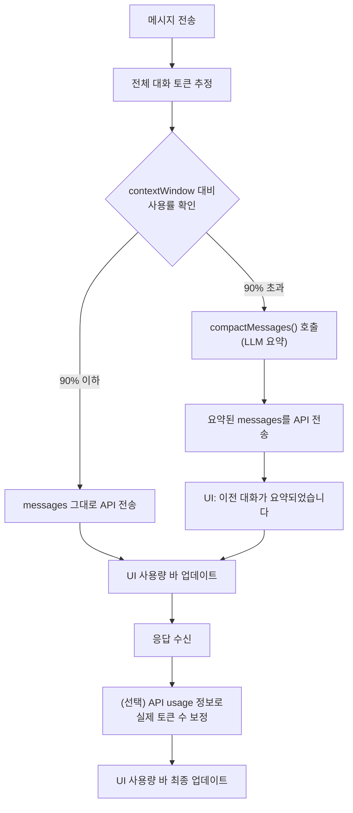

# Context Window Management

## 목적

대화가 길어질 때 모델의 컨텍스트 윈도우 한계를 관리. 토큰 사용량을 추적하고 시각적으로 표시하며, 한계 도달 시 자동으로 오래된 메시지를 압축한다.

**성공 기준**: 컨텍스트 사용량이 실시간으로 시각화되고, 90% 초과 시 LLM 요약 기반 자동 압축이 발동하여 대화 맥락을 보존하면서 50% 이하로 축소한다.

## 현재 상태

- DB `messages` 테이블에 `token_count` 컬럼 존재 (미사용, 항상 null)
- 프로바이더들이 API 응답의 usage 정보를 파싱하지 않음
- 컨텍스트 관리 없이 전체 대화 기록을 매번 API에 전송

## 설계

### 1. 모델별 Context Window 매핑

`providers.ts`의 `ModelInfo`에 `contextWindow` 필드 추가:

```typescript
export interface ModelInfo {
  id: string
  label: string
  desc: string
  contextWindow: number  // 토큰 수
}
```

주요 모델 context window:

| 모델 | Context |
|------|---------|
| claude-opus-4-6 | 200,000 |
| claude-sonnet-4-6 | 200,000 |
| claude-haiku-4-5 | 200,000 |
| gpt-5.4 | 128,000 |
| gpt-5.3-codex | 128,000 |
| gpt-5.2 | 128,000 |
| gemini-3.1-pro | 1,000,000 |
| gemini-3-flash | 1,000,000 |

### 2. 토큰 추정 (tiktoken 없이)

정밀한 토큰 카운팅은 모델별 토크나이저가 필요하지만, 실용적 근사치 사용:

```
영어: 1 token ≈ 4 characters
한국어: 1 token ≈ 1.5 characters
혼합: 1 token ≈ 2.5 characters (보수적 추정)
```

함수:
```typescript
function estimateTokens(text: string): number {
  // 한국어 비율 감지
  const koreanChars = (text.match(/[\uac00-\ud7af]/g) || []).length
  const totalChars = text.length
  const koreanRatio = totalChars > 0 ? koreanChars / totalChars : 0

  // 가중 평균: 한국어 1.5, 영어 4
  const charsPerToken = 4 - (koreanRatio * 2.5)
  return Math.ceil(totalChars / charsPerToken)
}
```

### 3. 토큰 사용량 추적

#### 방법 A: 추정 기반 (구현)
- 메시지 전송 전에 전체 대화의 토큰 수를 추정
- system prompt + 모든 메시지 content 합산
- 실시간 업데이트 가능, 외부 의존성 없음

#### 방법 B: API 응답 usage 파싱 (보조)
- Claude: `message_delta` 이벤트의 `usage.input_tokens`, `usage.output_tokens`
- OpenAI/Codex: 응답의 `usage.prompt_tokens`, `usage.completion_tokens`
- 정확하지만 응답 후에만 알 수 있음

→ **A를 기본으로, B를 보정용으로** 사용

### 4. Context Window Bar UI

채팅 헤더 또는 Composer 위에 얇은 바로 표시:

```
┌──────────────────────────────────────────┐
│ ████████████░░░░░░░░░░░░░  48% (96K/200K) │
└──────────────────────────────────────────┘
```

색상:
- 0-60%: accent (파란색)
- 60-80%: 노란색 (#fbbf24)
- 80-100%: 빨간색 (#f87171)

### 5. 자동 압축 (Compaction)

컨텍스트 80%에 도달하면 경고, 90%에 도달하면 자동 압축:

**전략**: 오래된 메시지들을 LLM에게 요약시켜 하나의 system 메시지로 교체

```
압축 전:
  [system] 스킬 프롬프트
  [user] 첫 번째 질문
  [assistant] 첫 번째 답변 (길다)
  [user] 두 번째 질문
  [assistant] 두 번째 답변 (길다)
  ...
  [user] 열 번째 질문         ← 최근 N개는 보존
  [assistant] 열 번째 답변

압축 후:
  [system] 스킬 프롬프트
  [system] <conversation_summary>
    사용자가 X에 대해 물었고, Y 방식으로 해결했다.
    주요 결정사항: A, B, C. 사용자 선호: D.
  </conversation_summary>
  [user] 열 번째 질문          ← 최근 N개 유지
  [assistant] 열 번째 답변
```

**압축 프롬프트**:
```
Summarize this conversation concisely. Preserve:
- Key decisions and conclusions
- User preferences and constraints
- Technical context (file paths, variable names, etc.)
- Unresolved questions or pending tasks

Keep the summary under 500 tokens. Use the same language as the conversation.
```

**보존 규칙**:
- system prompt (스킬): 항상 보존
- 최근 메시지: 마지막 4~6개 (user+assistant 쌍) 보존
- 나머지: 요약으로 교체

**구현**:
```typescript
async function compactMessages(
  messages: ChatMessage[],
  maxTokens: number,
  provider: string,
  accessToken: string,
  model?: string
): Promise<ChatMessage[]> {
  const target = maxTokens * 0.5  // 50%까지 줄임

  // system + 최근 6개 메시지 보존
  const systemMsgs = messages.filter(m => m.role === 'system')
  const nonSystem = messages.filter(m => m.role !== 'system')
  const keep = nonSystem.slice(-6)
  const toSummarize = nonSystem.slice(0, -6)

  if (toSummarize.length < 4) return messages  // 압축할 게 별로 없음

  // LLM에게 요약 요청
  const summaryText = await callLLM(provider, accessToken, [
    { role: 'system', content: COMPACTION_PROMPT },
    { role: 'user', content: toSummarize.map(m => `[${m.role}]: ${m.content}`).join('\n\n') }
  ], model)

  return [
    ...systemMsgs,
    { role: 'system', content: `<conversation_summary>\n${summaryText}\n</conversation_summary>` },
    ...keep
  ]
}
```

**비용**: 요약 API 호출 1회 (haiku급 모델 사용 가능)
**이점**: 잘라내기와 달리 맥락이 보존됨

압축 발생 시 UI에 "[이전 대화가 요약되었습니다]" 표시.

### 6. 데이터 흐름



### 7. 변경 파일

| 파일 | 변경 |
|------|------|
| `src/renderer/lib/providers.ts` | `ModelInfo`에 `contextWindow` 추가, 모든 모델에 값 설정 |
| `src/main/ipc/chat-handlers.ts` | 메시지 전송 전 truncation 로직, 토큰 추정 |
| `src/renderer/components/chat/AssistantThread.tsx` | Context bar UI 추가 |
| `src/renderer/stores/app-store.ts` | `contextUsage: { used: number; max: number }` 상태 추가 |
| `src/preload/index.ts` | context usage IPC 이벤트 |

### 8. 의사결정 근거

| 결정 | 채택 방안 | 기각 대안 | 기각 이유 |
|------|-----------|-----------|-----------|
| 토큰 카운팅 | 문자 수 기반 근사치 | tiktoken (OpenAI 토크나이저 라이브러리) | npm 패키지 수 MB, 모델별 인코더가 다름. 근사치로 충분 |
| 컨텍스트 초과 대응 | LLM 요약 기반 압축 | 오래된 메시지 잘라내기 | 잘라내기는 맥락 손실. 압축은 API 1회 호출 비용이 들지만 대화 흐름 유지 |
| 압축 타겟 | 50%까지 축소 | 70-80% 축소 | 압축 후에도 충분한 여유 확보, 재압축 빈도 감소 |
| 요약 모델 | haiku급 경량 모델 | 사용자 선택 모델 | 요약은 경량 모델로도 충분, 비용 최소화 |
| system prompt | 항상 보존 | 함께 요약 | 스킬 동작에 필수, 요약 시 스킬 지시사항이 손실됨 |
