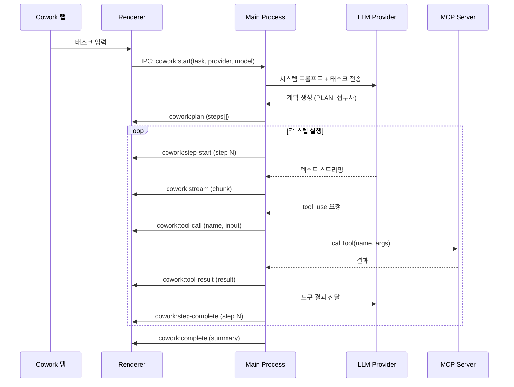

# Cowork Feature Design

## 1. 목적

Chat 탭 옆의 **Cowork** 탭을 활성화하여, 단순 대화가 아닌 **자율적 멀티스텝 태스크 실행** 모드를 제공한다.

**성공 기준**: 사용자가 자연어로 태스크를 입력하면 LLM이 계획을 수립하고, MCP 도구를 사용하여 3단계 이상의 작업을 사용자 개입 없이 자동 완료할 수 있다.

참고: [open-claude-cowork](https://github.com/ComposioHQ/open-claude-cowork)

## 2. Chat vs Cowork 차이점

| | Chat | Cowork |
|---|---|---|
| 목적 | 1문 1답 대화 | 태스크 자율 실행 |
| Agent loop | tool call 시에만 반복 | 계획 수립 → 여러 스텝 자동 실행 |
| UI | 채팅 말풍선 | 태스크 입력 + 계획/진행 패널 |
| Tool display | 없음 (내부적 처리) | 인라인 + 사이드바에 실시간 표시 |
| 세션 | 대화별 | 태스크별 (더 긴 세션) |

## 3. Architecture

### 3.1 기존 인프라 재활용

| 기존 모듈 | Cowork에서 | 변경 |
|-----------|-----------|------|
| Providers (Codex, Gemini...) | 그대로 사용 | 없음 |
| MCP Manager | 그대로 사용 (도구 실행) | 없음 |
| Agent Loop (chat-handlers) | Cowork용 확장 핸들러 | cowork-handlers.ts 추가 |
| IPC Bridge | cowork: 네임스페이스 추가 | preload 확장 |
| Zustand Store | cowork 상태 추가 | app-store 확장 |

### 3.2 데이터 흐름



### 3.3 시스템 프롬프트

```
You are an autonomous task executor. When given a task:
1. First, output a plan as a numbered list (prefix each line with "PLAN:")
2. Then execute each step using available tools
3. After each step, output "STEP_COMPLETE: N"
4. When all done, output "TASK_COMPLETE" with a summary

Available tools: [MCP tools list]
Working directory: [user selected or default]
```

## 4. UI Design

### 4.1 Cowork View (Chat 대신 표시)

```
┌─────────────────────────────────────────────────┐
│ [Chat]  [Cowork]  [Code]        Title      [U]  │
├────────────────────────────┬────────────────────┤
│                            │ Progress           │
│  Task Input / Results      │                    │
│  ┌─────────────────────┐   │ ✅ Step 1: 분석    │
│  │ 태스크를 입력하세요..  │   │ ⏳ Step 2: 구현    │
│  └─────────────────────┘   │ ○ Step 3: 테스트    │
│                            │                    │
│  [실행 결과 스트리밍]       │ Tool Calls         │
│  ┌─────────────────────┐   │ ⚙ Read ✓           │
│  │ 마크다운 렌더링       │   │ ⚙ Write ⏳         │
│  │                     │   │ ⚙ Bash ○           │
│  │ ⚙ Read file.ts  ▼  │   │                    │
│  │   Input: {...}      │   │                    │
│  │   Output: {...}     │   │                    │
│  │                     │   │                    │
│  │ 계속 실행중...       │   │                    │
│  └─────────────────────┘   │                    │
│                            │                    │
│  [──────────────] [Stop]   │                    │
├────────────────────────────┴────────────────────┤
│  Composer (follow-up instructions)              │
└─────────────────────────────────────────────────┘
```

### 4.2 Progress Sidebar (우측 패널)

- **Steps**: 계획에서 파싱된 스텝 목록, 실시간 상태 업데이트
- **Tool Calls**: 도구 호출 실시간 표시 (이름, 입력, 결과, 상태)
- 접을 수 있음 (collapse 버튼)

### 4.3 Inline Tool Calls (메시지 내)

open-claude-cowork의 DOM 청킹 패턴 적용:
- 텍스트 → 도구 호출 → 텍스트 → 도구 호출 순서로 interleave
- 각 청크는 독립 렌더링 (이전 마크다운 재렌더링 방지)

## 5. Components

### 새 파일

| File | Purpose |
|------|---------|
| `src/renderer/components/cowork/CoworkView.tsx` | 메인 Cowork 뷰 |
| `src/renderer/components/cowork/TaskInput.tsx` | 태스크 입력 UI |
| `src/renderer/components/cowork/ExecutionStream.tsx` | 실행 결과 스트리밍 |
| `src/renderer/components/cowork/ProgressPanel.tsx` | 우측 진행상황 패널 |
| `src/renderer/components/cowork/InlineToolCall.tsx` | 인라인 도구 호출 표시 |
| `src/main/ipc/cowork-handlers.ts` | Cowork IPC 핸들러 |

### 수정 파일

| File | Change |
|------|--------|
| `src/renderer/components/chat/ChatView.tsx` | TopBar 탭 클릭 시 모드 전환 |
| `src/renderer/stores/app-store.ts` | cowork 상태 추가 |
| `src/preload/index.ts` | cowork IPC 브릿지 추가 |
| `src/main/index.ts` | cowork 핸들러 등록 |

## 6. Store State

```typescript
// app-store.ts 추가
activeView: 'chat' | 'cowork' | 'code'
setActiveView: (view) => void

// Cowork 상태
coworkTask: string | null
coworkPlan: string[]          // 계획 스텝 목록
coworkCurrentStep: number     // 현재 실행 중인 스텝
coworkStepStatuses: Record<number, 'pending' | 'running' | 'done' | 'error'>
coworkToolCalls: Array<{
  id: string
  name: string
  input: Record<string, unknown>
  status: 'running' | 'success' | 'error'
  result?: string
}>
coworkStreamText: string
coworkIsRunning: boolean
```

## 7. IPC API

### New Handlers

```typescript
// Main process
ipcMain.handle('cowork:start', async (event, task, provider, model, reasoningEffort?) => { ... })
ipcMain.handle('cowork:stop', async (event) => { ... })
ipcMain.handle('cowork:follow-up', async (event, instruction) => { ... })

// Events (Main → Renderer)
'cowork:plan'          // { steps: string[] }
'cowork:step-start'    // { step: number }
'cowork:stream'        // { chunk: string }
'cowork:tool-call'     // { id, name, input }
'cowork:tool-result'   // { id, result, status }
'cowork:step-complete'  // { step: number }
'cowork:complete'      // { summary: string }
'cowork:error'         // { error: string }
```

### Preload Bridge

```typescript
cowork: {
  start: (task: string, provider: string, model?: string, reasoningEffort?: string) =>
    ipcRenderer.invoke('cowork:start', task, provider, model, reasoningEffort),
  stop: () => ipcRenderer.invoke('cowork:stop'),
  followUp: (instruction: string) => ipcRenderer.invoke('cowork:follow-up', instruction),
  onPlan: (cb) => { ... },
  onStepStart: (cb) => { ... },
  onStream: (cb) => { ... },
  onToolCall: (cb) => { ... },
  onToolResult: (cb) => { ... },
  onStepComplete: (cb) => { ... },
  onComplete: (cb) => { ... },
  onError: (cb) => { ... },
}
```

## 8. Agent Loop (Cowork 전용)

기존 `chat-handlers.ts`의 agent loop를 확장:

```typescript
async function runCoworkTask(task, provider, accessToken, model, tools, win) {
  const systemPrompt = COWORK_SYSTEM_PROMPT
  const messages = [
    { role: 'system', content: systemPrompt },
    { role: 'user', content: task }
  ]

  let fullResponse = ''

  // Agent loop — 계속 실행 (tool_use가 있으면 자동 계속)
  while (true) {
    const result = await llmProvider.sendMessage(messages, tools, accessToken, {
      onToken: (text) => {
        fullResponse += text
        win.send('cowork:stream', { chunk: text })
        // Plan 파싱: "PLAN:" 접두사 감지
        parsePlanIfNeeded(text, win)
        // Step 완료 감지: "STEP_COMPLETE: N"
        parseStepCompleteIfNeeded(text, win)
      },
      onToolCall: (tc) => {
        win.send('cowork:tool-call', { id: tc.id, name: tc.name, input: tc.arguments })
      },
      onComplete: () => {},
      onError: (err) => { win.send('cowork:error', { error: err.message }) }
    }, model)

    if (result.stopReason === 'tool_use' && result.toolCalls) {
      // 도구 실행 후 메시지 추가하고 계속
      const toolResults = await executeToolCalls(result.toolCalls, mcpManager)
      for (const tr of toolResults) {
        win.send('cowork:tool-result', { id: tr.toolCallId, result: tr.content, status: 'success' })
      }
      messages.push({ role: 'assistant', content: fullResponse })
      messages.push(...toolResults.map(tr => ({ role: 'tool', content: tr.content, toolCallId: tr.toolCallId })))
      fullResponse = ''
      continue
    }

    // 종료
    win.send('cowork:complete', { summary: fullResponse })
    break
  }
}
```

## 9. 의사결정 근거

| 결정 | 채택 방안 | 기각 대안 | 기각 이유 |
|------|-----------|-----------|-----------|
| Agent loop 구조 | 기존 chat-handlers 확장 | 별도 agent 프레임워크 (LangChain 등) | 외부 의존성 증가, 기존 인프라로 충분 |
| Plan 파싱 방식 | 텍스트 접두사 파싱 ("PLAN:") | 구조화된 JSON 출력 | 모든 LLM에서 호환, 스트리밍 중 파싱 가능 |
| UI 구조 | 2-pane (메인 + 사이드바) | 단일 스트림 뷰 | 계획/진행상황을 독립적으로 추적 가능 |
| DOM 렌더링 | 청크별 독립 렌더링 | 전체 재렌더링 | 성능 — 이전 마크다운 재렌더링 방지 |

## 10. 구현 순서

1. **Store + IPC 기반** — activeView, cowork 상태, IPC 브릿지
2. **TopBar 탭 전환** — Chat / Cowork / Code 탭 클릭 동작
3. **CoworkView 기본 UI** — 태스크 입력 + 결과 스트리밍 영역
4. **cowork-handlers.ts** — 백엔드 agent loop
5. **ProgressPanel** — 우측 계획/도구 패널
6. **InlineToolCall** — 인라인 도구 호출 표시
7. **Follow-up** — 실행 중 추가 지시 기능
