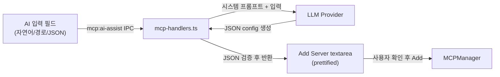

# MCP AI Assist

## 1. 목적

MCP 서버 추가 시 JSON을 직접 작성하는 대신, 자연어 또는 파일 경로로 설정을 생성하는 AI 어시스트.

**성공 기준**: 사용자가 "fetch 서버 추가해줘"와 같은 자연어 입력으로 유효한 MCP 서버 JSON 설정을 생성하고, Add Server textarea에 자동 입력할 수 있다.

## 2. 입력 방식

1. **자연어**: "fetch 서버 추가해줘", "GitHub MCP 연결", "파일시스템 접근"
2. **로컬 파일 경로**: `/path/to/server.py`, `./my-mcp-server/index.ts`
3. **JSON 정리**: 잘못된 JSON 붙여넣기 → AI가 포맷팅/수정

## 3. 아키텍처

### 데이터 흐름



1. 사용자가 Settings > MCP > AI 입력 필드에 자연어 또는 파일 경로를 입력
2. Renderer → IPC `mcp:ai-assist(input)` → Main Process
3. `mcp-handlers.ts`가 시스템 프롬프트(인기 MCP 서버 DB 포함) + 사용자 입력을 LLM에 전송
4. LLM이 JSON config를 생성
5. Main Process가 JSON 유효성 검증 후 Renderer에 반환
6. 생성된 JSON이 Add Server textarea에 자동 입력 (prettified)
7. 사용자가 확인 후 Add 버튼 클릭

## 4. API 설계

### IPC Handler

```typescript
// Main process (mcp-handlers.ts)
ipcMain.handle('mcp:ai-assist', async (_, input: string): Promise<string> => {
  // input: 자연어, 파일 경로, 또는 잘못된 JSON
  // returns: 유효한 MCP 서버 JSON config (prettified)
})

// Preload bridge
mcp: {
  ...existing,
  aiAssist: (input: string) => ipcRenderer.invoke('mcp:ai-assist', input)
}
```

### AI System Prompt 핵심

- 인기 MCP 서버 DB (name, command, args, env)
- stdio 서버: `uvx`, `npx`, `node`, `python` 등 런타임 추론
- http/sse 서버: URL 기반 설정
- 로컬 파일 경로: 확장자로 런타임 추론 (.py → `uv run python`, .ts → `npx tsx`, .js → `node`)
- env 변수 필요 시 placeholder로 안내 (예: `YOUR_API_KEY`)
- JSON 포맷팅/검증

## 5. UI

Add Server 영역 위에 AI 입력:

```
┌─────────────────────────────────────────┐
│ "fetch 서버 추가해줘"          [Generate] │
└─────────────────────────────────────────┘
↓ 생성된 JSON이 아래 textarea에 들어감
┌─────────────────────────────────────────┐
│ {                                       │
│   "name": "fetch",                      │
│   "type": "stdio",                      │
│   ...                                   │
│ }                               [Add]   │
└─────────────────────────────────────────┘
```

## 6. 파일 구조

### 변경 파일

| 파일 | 변경 |
|------|------|
| `src/main/ipc/mcp-handlers.ts` | `mcp:ai-assist` IPC 핸들러 추가 |
| `src/preload/index.ts` | `aiAssist` API 추가 |
| `src/renderer/components/settings/SettingsPanel.tsx` | MCPTab에 AI 입력 UI |

## 7. 의사결정 근거

| 결정 | 채택 방안 | 기각 대안 | 기각 이유 |
|------|-----------|-----------|-----------|
| 설정 생성 방식 | LLM 기반 자연어 → JSON | 템플릿 기반 드롭다운 | MCP 서버가 다양하여 템플릿으로 커버 불가 |
| 검증 방식 | JSON.parse 유효성만 검증 | 실제 서버 연결 테스트 | 즉시 피드백 우선, 연결은 Add 후 수행 |
| AI 모델 | 사용자가 선택한 현재 provider/model 사용 | 고정 모델 (예: haiku) | 별도 API 키 불필요, 구독 쿼타 활용 |
