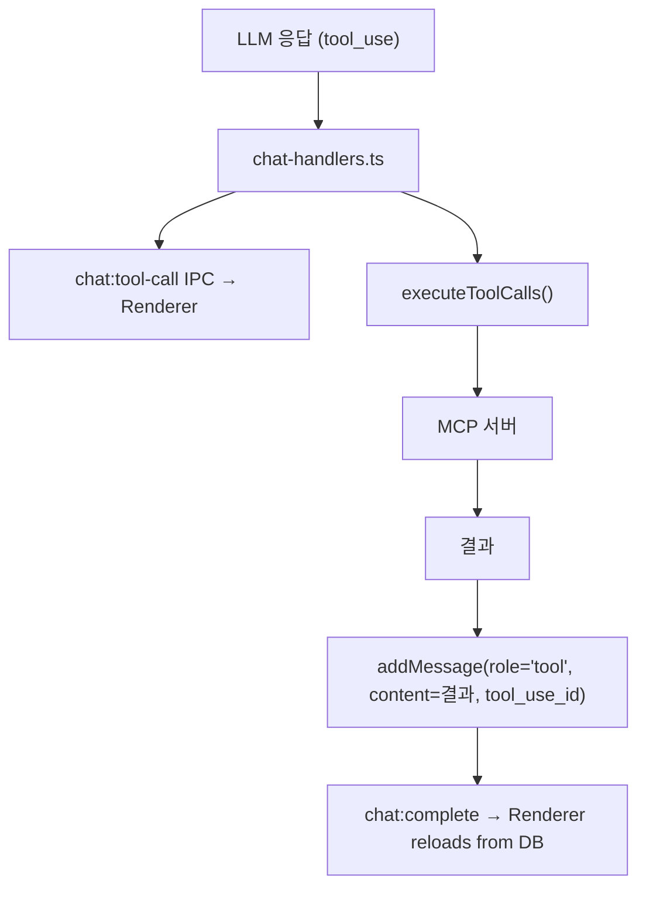

# MCP Tool Call Visualization

## 목적

채팅에서 MCP 툴 호출 시 **툴 이름, 인자, 실행 결과**를 사용자에게 보여주는 기능.
현재는 "Tool executed"라는 일반 텍스트만 표시됨.

**성공 기준**: 모든 MCP 툴 호출이 툴 이름, 입력 인자(JSON), 실행 결과를 접기/펼치기 가능한 UI로 표시되며, DB에 영구 저장되어 대화 재로드 시에도 유지된다.

## 현재 상태

### 데이터 흐름



### 문제점

1. DB `messages` 테이블에 `tool_name`, `tool_args` 컬럼 없음
2. `addMessage(role='tool')` 호출 시 결과(content)와 tool_use_id만 저장
3. `buildThreadMessages()`가 `toolName: 'tool'`, `args: {}` 하드코딩
4. `ToolCallPart` 컴포넌트가 "Tool executed"만 렌더링

## 설계

### 1. DB 마이그레이션

`messages` 테이블에 2개 컬럼 추가:

```sql
ALTER TABLE messages ADD COLUMN tool_name TEXT;
ALTER TABLE messages ADD COLUMN tool_args TEXT;  -- JSON string
```

### 2. 백엔드 변경

**`conversations.ts`** — `Message` 인터페이스 + `addMessage` 시그니처 확장:

```typescript
interface Message {
  // ... existing
  tool_name: string | null
  tool_args: string | null  // JSON
}

function addMessage(
  conversationId, role, content,
  toolUseId?, tokenCount?, attachments?,
  toolName?, toolArgs?  // 신규
)
```

**`chat-handlers.ts`** — 툴 결과 저장 시 이름/인자 포함:

```typescript
// Before:
addMessage(conversationId, 'tool', tr.content, tr.toolCallId)

// After:
addMessage(conversationId, 'tool', tr.content, tr.toolCallId,
  undefined, undefined, tr.toolName, JSON.stringify(tr.toolArgs))
```

`executeToolCalls` 반환값에 `toolName`, `toolArgs` 추가.

### 3. 렌더러 변경

**`app-store.ts`** — `Message` 타입에 `tool_name`, `tool_args` 추가

**`use-assistant-runtime.ts`** — `buildThreadMessages`에서 실제 이름/인자 사용:

```typescript
toolResults.push({
  type: 'tool-call',
  toolCallId: toolMsg.tool_use_id,
  toolName: toolMsg.tool_name ?? 'unknown',
  args: toolMsg.tool_args ? JSON.parse(toolMsg.tool_args) : {},
  argsText: toolMsg.tool_args ?? '',
  result: toolMsg.content
})
```

**`AssistantThread.tsx`** — `ToolCallPart` 리디자인:

```
┌─────────────────────────────────────────┐
│ ✓ fetch                        [접기 ▾] │
│ ───────────────────────────────────────  │
│ Args: { "url": "https://..." }          │
│ ───────────────────────────────────────  │
│ Result: (200 OK, 1.2KB)                 │
│   The quick brown fox jumps over...     │
└─────────────────────────────────────────┘
```

- 기본 접힌 상태: 툴 이름 + 상태 아이콘만 표시
- 클릭 시 펼쳐서 인자 + 결과 표시
- 결과가 길면 truncate + "Show more"
- `serverName__toolName` → `toolName` (서버 prefix 제거)

### 4. 파일 변경 목록

| 파일 | 변경 |
|------|------|
| `src/main/db/database.ts` | `tool_name`, `tool_args` 마이그레이션 |
| `src/main/db/conversations.ts` | `Message` 인터페이스, `addMessage` 확장 |
| `src/main/ipc/chat-handlers.ts` | `executeToolCalls` 반환값 확장, `addMessage` 호출 수정 |
| `src/renderer/stores/app-store.ts` | `Message` 타입 확장 |
| `src/renderer/hooks/use-assistant-runtime.ts` | `buildThreadMessages`에서 실제 이름/인자 사용 |
| `src/renderer/components/chat/AssistantThread.tsx` | `ToolCallPart` 리디자인 |

### 5. 의사결정 근거

| 결정 | 채택 방안 | 기각 대안 | 기각 이유 |
|------|-----------|-----------|-----------|
| 도구 정보 저장 | DB 컬럼 추가 (tool_name, tool_args) | content JSON 내 포함 | 컬럼이 쿼리/인덱스 친화적이고 기존 content 포맷 안 깨짐 |
| 기본 UI 상태 | 접힌 상태 (이름 + 상태만) | 항상 펼침 | 툴 결과가 수천 글자일 수 있어 항상 펼치면 가독성 저하 |
| 서버 prefix | 제거 (toolName만 표시) | 전체 표시 (serverName__toolName) | `fetch__fetch` 같은 내부 네이밍은 사용자에게 불필요한 노이즈 |
