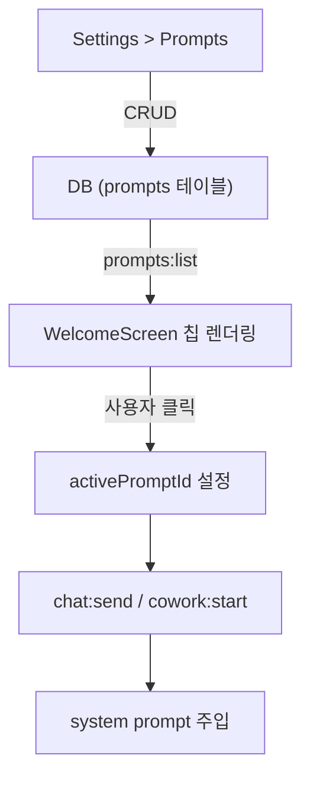

# Global Prompts (Skills) Feature Design

## 1. 목적

사용자가 전역 프롬프트(시스템 프롬프트/스킬)를 생성·관리하고, 대화 시작 시 선택하여 주입할 수 있는 기능.

Claude Desktop의 CLAUDE.md, Claude Code의 Skills와 유사한 역할.

**성공 기준**: 사용자가 프롬프트를 CRUD로 관리하고, WelcomeScreen 칩 클릭으로 선택하면 해당 프롬프트가 system message로 대화에 주입된다.

## 2. 핵심 기능

| 기능 | 설명 |
|------|------|
| **프롬프트 CRUD** | 제목 + 내용으로 프롬프트 생성/수정/삭제 |
| **WelcomeScreen 칩** | 등록된 프롬프트가 입력창 아래 칩으로 표시 → 클릭 시 시스템 프롬프트로 주입 |
| **Settings 탭** | Settings > Prompts 탭에서 전체 관리 |
| **대화 연결** | 프롬프트 선택 후 대화 시작 → 해당 프롬프트가 system message로 전달 |

## 3. Architecture

### 3.1 데이터 흐름



### 3.2 DB 스키마

```sql
CREATE TABLE IF NOT EXISTS prompts (
  id         TEXT PRIMARY KEY,
  title      TEXT NOT NULL,
  content    TEXT NOT NULL,
  icon       TEXT DEFAULT 'default',
  sort_order INTEGER NOT NULL DEFAULT 0,
  created_at INTEGER NOT NULL DEFAULT (strftime('%s', 'now')),
  updated_at INTEGER NOT NULL DEFAULT (strftime('%s', 'now'))
);
```

## 4. UI Design

### 4.1 WelcomeScreen 칩

```
┌──────────────────────────────────────┐
│        ✦ Good afternoon.            │
│      How can I help you today?       │
│                                      │
│  ┌─────────────────────────────────┐ │
│  │ Type to start a conversation... │ │
│  │ [+] [Provider ▾] [Model ▾] [↑] │ │
│  └─────────────────────────────────┘ │
│                                      │
│  [📝 코드리뷰] [🔍 분석] [✏️ 작문]    │
│                                      │
└──────────────────────────────────────┘
```

- 프롬프트가 0개면 칩 영역 숨김
- 클릭 → `activePromptId` 설정 + 입력창 포커스
- 선택된 칩은 accent 색상으로 강조, 다시 클릭하면 해제

### 4.2 Settings > Prompts 탭

```
┌───────────────────────────────────────────────┐
│ Prompts                          [+ New]      │
├───────────────────────────────────────────────┤
│                                               │
│  ┌───────────────────────────────────────┐    │
│  │ 📝 코드 리뷰                     [⋯] │    │
│  │ 코드를 리뷰하고 개선점을 제안...       │    │
│  └───────────────────────────────────────┘    │
│                                               │
│  ┌───────────────────────────────────────┐    │
│  │ 🔍 코드 분석                     [⋯] │    │
│  │ 코드의 구조와 동작을 분석...           │    │
│  └───────────────────────────────────────┘    │
│                                               │
└───────────────────────────────────────────────┘
```

### 4.3 프롬프트 편집 모달

```
┌─────────────────────────────────────┐
│ New Prompt                     [✕]  │
├─────────────────────────────────────┤
│                                     │
│ Title                               │
│ ┌─────────────────────────────────┐ │
│ │ 코드 리뷰                       │ │
│ └─────────────────────────────────┘ │
│                                     │
│ System Prompt                       │
│ ┌─────────────────────────────────┐ │
│ │ You are an expert code reviewer.│ │
│ │ Review the code for:            │ │
│ │ - Bugs and logic errors         │ │
│ │ - Performance issues            │ │
│ │ - Security vulnerabilities      │ │
│ │ - Code style and best practices │ │
│ └─────────────────────────────────┘ │
│                                     │
│              [Cancel] [Save]        │
└─────────────────────────────────────┘
```

## 5. Components

### 새 파일

| File | Purpose |
|------|---------|
| `src/main/ipc/prompt-handlers.ts` | Prompts CRUD IPC 핸들러 |
| `src/renderer/components/settings/PromptsTab.tsx` | Settings 프롬프트 관리 탭 |

### 수정 파일

| File | Change |
|------|--------|
| `src/main/db/database.ts` | `prompts` 테이블 마이그레이션 추가 |
| `src/main/index.ts` | prompt-handlers 등록 |
| `src/preload/index.ts` | `prompts:` IPC 브릿지 추가 |
| `src/renderer/stores/app-store.ts` | `activePromptId`, prompts 상태 추가 |
| `src/renderer/components/settings/SettingsPanel.tsx` | Prompts 탭 추가 |
| `src/renderer/components/chat/ChatView.tsx` | WelcomeScreen에 프롬프트 칩 표시 |
| `src/main/ipc/chat-handlers.ts` | system prompt 주입 로직 |

## 6. IPC API

```typescript
// Preload bridge
prompts: {
  list: () => ipcRenderer.invoke('prompts:list'),
  create: (title: string, content: string) => ipcRenderer.invoke('prompts:create', title, content),
  update: (id: string, title: string, content: string) => ipcRenderer.invoke('prompts:update', id, title, content),
  delete: (id: string) => ipcRenderer.invoke('prompts:delete', id),
  reorder: (ids: string[]) => ipcRenderer.invoke('prompts:reorder', ids)
}
```

## 7. Store State

```typescript
// app-store.ts 추가
prompts: Prompt[]
setPrompts: (prompts: Prompt[]) => void
activePromptId: string | null       // WelcomeScreen에서 선택된 프롬프트
setActivePromptId: (id: string | null) => void

interface Prompt {
  id: string
  title: string
  content: string
  icon: string
  sort_order: number
  created_at: number
  updated_at: number
}
```

## 8. System Prompt 주입

```typescript
// chat-handlers.ts 수정
if (promptId) {
  const prompt = db.queryOne('SELECT content FROM prompts WHERE id = ?', [promptId])
  if (prompt) {
    messages.unshift({ role: 'system', content: prompt.content })
  }
}
```

## 9. 의사결정 근거

| 결정 | 채택 방안 | 기각 대안 | 기각 이유 |
|------|-----------|-----------|-----------|
| 프롬프트 구조 | 플랫 리스트 (sort_order) | 폴더/카테고리 계층 | 초기 프롬프트 수가 적어 계층 불필요, sort_order로 순서 관리 충분 |
| 선택 UI | WelcomeScreen 칩 | Composer 드롭다운 | 시각적 발견성(discoverability) 우수, 클릭 한 번으로 선택 가능 |
| 저장소 | SQLite 테이블 | 로컬 .md 파일 | 기존 DB 인프라 활용, 정렬/검색 쿼리 지원 |

## 10. 구현 순서

1. **DB 마이그레이션** — prompts 테이블 생성
2. **IPC 핸들러** — CRUD + reorder
3. **Preload 브릿지** — prompts 네임스페이스
4. **Store 상태** — prompts, activePromptId
5. **Settings > Prompts 탭** — 목록 + 생성/편집/삭제 모달
6. **WelcomeScreen 칩** — 프롬프트 칩 표시 + 선택
7. **System prompt 주입** — chat:send, cowork:start에 연동
