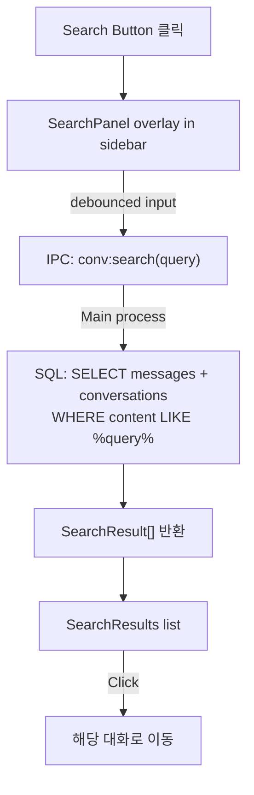
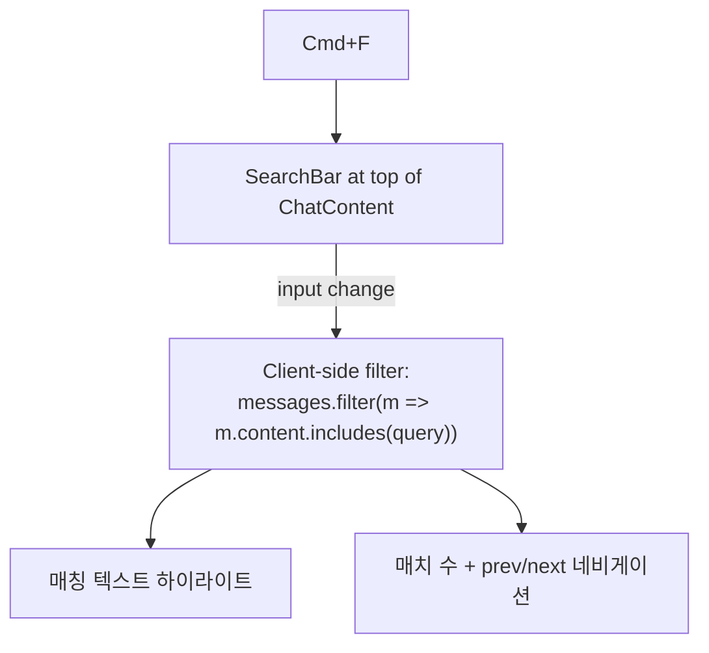

# Search Feature Design

## 1. 목적

대화 기록을 검색하는 두 가지 모드를 제공한다.

- **Global Search** (sidebar button) — 전체 대화 기록 검색
- **In-Chat Search** (Cmd+F) — 현재 대화 내 인라인 검색

**성공 기준**: 글로벌 검색이 500ms 이내에 결과를 반환하고, 인라인 검색은 입력 즉시(100ms 이내) 하이라이트를 표시한다.

## 2. Architecture

### 2.1 Global Search (Sidebar)



**UI Flow:**
1. User clicks search icon in sidebar (magnifying glass)
2. Sidebar transitions: conversation list → search panel (with back button)
3. Search input auto-focused at top
4. Results grouped by conversation, showing message snippets with highlighted query
5. Click result → set activeConversationId → scroll to message (future enhancement)

### 2.2 In-Chat Search (Cmd+F)



**UI Flow:**
1. User presses Cmd+F while chat is active
2. Search bar appears at top of chat area (below header)
3. Matching text highlighted in yellow across all messages
4. "N of M" counter with up/down arrows to jump between matches
5. Esc or X button closes search bar

## 3. Database

### New Query (no schema changes needed)

```sql
-- Global search: find messages matching query
SELECT m.id, m.conversation_id, m.content, m.role, m.created_at,
       c.title as conversation_title
FROM messages m
JOIN conversations c ON c.id = m.conversation_id
WHERE m.content LIKE '%' || ? || '%'
  AND m.role IN ('user', 'assistant')
ORDER BY m.created_at DESC
LIMIT 50
```

No new tables or indexes required. The existing `idx_messages_conv` index covers conversation-level queries. For global text search, SQLite LIKE is sufficient for the expected data volume (local chat history).

## 4. IPC API

### New Handlers

```typescript
// Main process
ipcMain.handle('conv:search', async (_, query: string) => {
  return db.searchMessages(query) // returns SearchResult[]
})

// Preload bridge
conv: {
  ...existing,
  search(query: string): Promise<SearchResult[]>
}
```

### Types

```typescript
interface SearchResult {
  messageId: string
  conversationId: string
  conversationTitle: string
  content: string       // full message content (truncated for display in renderer)
  role: 'user' | 'assistant'
  createdAt: number
}
```

## 5. Components

### New Files

| File | Purpose |
|------|---------|
| `src/renderer/components/sidebar/SearchPanel.tsx` | Global search UI in sidebar |
| `src/renderer/components/chat/ChatSearchBar.tsx` | Cmd+F in-chat search bar |

### Modified Files

| File | Change |
|------|--------|
| `src/renderer/components/sidebar/Sidebar.tsx` | Toggle between ConversationList and SearchPanel |
| `src/renderer/components/chat/ChatView.tsx` | Add ChatSearchBar + Cmd+F keyboard listener |
| `src/renderer/stores/app-store.ts` | Add search state (sidebarSearch, chatSearch) |
| `src/main/db/conversations.ts` | Add `searchMessages()` query |
| `src/main/ipc/chat-handlers.ts` | Add `conv:search` handler |
| `src/preload/index.ts` | Add `conv.search()` bridge |

## 6. Store State

```typescript
// app-store.ts additions
sidebarMode: 'conversations' | 'search'
setSidebarMode: (mode) => void
```

## 7. UI Design

### Global Search Panel (replaces conversation list)
```
┌─────────────────────┐
│ ← Back    Search    │
├─────────────────────┤
│ 🔍 [search input..] │
├─────────────────────┤
│ Conversation Title 1│
│  "...matched text..." │
│  user · 2min ago    │
├─────────────────────┤
│ Conversation Title 2│
│  "...matched text..." │
│  assistant · 1hr ago│
└─────────────────────┘
```

### In-Chat Search Bar (top of chat)
```
┌──────────────────────────────────┐
│ 🔍 [search...] │ 3 of 12 │ ↑ ↓ │ ✕ │
└──────────────────────────────────┘
```

## 8. 의사결정 근거

| 결정 | 채택 방안 | 기각 대안 | 기각 이유 |
|------|-----------|-----------|-----------|
| 글로벌 검색 엔진 | SQLite LIKE | SQLite FTS5 | 로컬 대화 데이터 규모에서 LIKE로 충분, FTS5 설정 복잡도 불필요 |
| 인라인 검색 방식 | 클라이언트 사이드 필터링 | DB 쿼리 | 현재 대화 메시지는 이미 메모리에 로드됨, IPC 왕복 불필요 |
| 검색 UI 위치 | 사이드바 오버레이 | 별도 페이지/모달 | 대화 컨텍스트 유지하면서 검색 가능 |

## 9. Keyboard Shortcuts

| Shortcut | Action |
|----------|--------|
| `Cmd+F` | Open in-chat search (when conversation active) |
| `Escape` | Close search bar / back to conversation list |
| `Enter` / `Cmd+G` | Next match (in-chat) |
| `Shift+Enter` / `Cmd+Shift+G` | Previous match (in-chat) |
