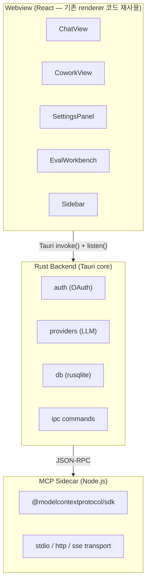

# Tauri + Rust 마이그레이션 설계

## 목적

Electron (200MB+, 300MB RAM) → Tauri + Rust (15MB, 30MB RAM)로 전환.
기존 React 프론트엔드 유지, 백엔드만 Rust로 재작성.
MCP는 Node.js 사이드카로 분리.

**성공 기준**: 앱 크기 65MB 이하, RAM 사용량 50MB 이하를 달성하면서 기존 Electron 버전의 모든 기능(5개 provider OAuth, MCP, Cowork, Skills, Eval)이 동일하게 동작한다.

## 아키텍처



## 레이어별 상세

### 1. Frontend (React — 거의 그대로)

**변경 최소화 전략**: `window.api.*` → Tauri `invoke()` + `listen()` 어댑터 레이어만 교체.

```typescript
// 현재 (Electron)
window.api.chat.send(convId, msg, provider)
window.api.chat.onStream(callback)

// 변경 후 (Tauri)
import { invoke } from '@tauri-apps/api/core'
import { listen } from '@tauri-apps/api/event'

invoke('chat_send', { conversationId, message, provider })
listen('chat:stream', (event) => callback(event.payload))
```

**어댑터 파일**: `src/lib/tauri-api.ts` — 기존 `window.api` 인터페이스를 Tauri invoke/listen으로 매핑. 프론트엔드 컴포넌트는 변경 없이 이 어댑터만 교체.

**유지되는 것:**
- 모든 React 컴포넌트 (ChatView, Sidebar, Settings, Eval 등)
- Zustand 스토어
- Tailwind CSS 스타일
- Shiki 하이라이팅
- @assistant-ui/react-markdown

**제거되는 것:**
- `src/preload/index.ts` (contextBridge 불필요)
- Electron 의존성 (electron, electron-vite, electron-builder)

### 2. Rust Backend

#### 2a. 프로젝트 구조

```
src-tauri/
├── Cargo.toml
├── tauri.conf.json
├── src/
│   ├── main.rs              # Tauri 앱 진입점
│   ├── auth/
│   │   ├── mod.rs
│   │   ├── pkce.rs           # PKCE 생성
│   │   ├── oauth_server.rs   # 로컬 OAuth 콜백 서버
│   │   ├── token_store.rs    # keyring 기반 토큰 저장
│   │   └── providers.rs      # Codex, Gemini, Copilot, Claude OAuth
│   ├── providers/
│   │   ├── mod.rs
│   │   ├── base.rs           # trait LLMProvider
│   │   ├── codex.rs          # ChatGPT/Codex SSE
│   │   ├── gemini.rs         # Gemini SSE
│   │   ├── copilot.rs        # Copilot (OpenAI 호환)
│   │   ├── claude.rs         # Claude Messages API
│   │   └── router.rs         # 프로바이더 라우팅
│   ├── db/
│   │   ├── mod.rs
│   │   ├── schema.rs         # 테이블 생성 + 마이그레이션
│   │   ├── conversations.rs  # CRUD
│   │   ├── skills.rs         # 스킬 + 프리셋
│   │   └── evals.rs          # Eval 시스템
│   ├── mcp/
│   │   ├── mod.rs
│   │   └── sidecar.rs        # Node.js 사이드카 통신
│   └── commands/
│       ├── mod.rs
│       ├── chat.rs           # #[tauri::command] chat_send, chat_stop
│       ├── auth.rs           # connect, disconnect, status
│       ├── conv.rs           # list, create, delete, export
│       ├── mcp.rs            # list_tools, call_tool, add_server
│       ├── skills.rs         # CRUD + AI
│       └── eval.rs           # Eval workbench
└── sidecar/
    ├── package.json          # @modelcontextprotocol/sdk 만 포함
    ├── mcp-bridge.ts         # JSON-RPC over stdin/stdout
    └── tsconfig.json
```

#### 2b. 핵심 Crate 의존성

```toml
[dependencies]
tauri = { version = "2", features = ["shell-open"] }
tauri-plugin-shell = "2"       # 사이드카 실행
serde = { version = "1", features = ["derive"] }
serde_json = "1"
tokio = { version = "1", features = ["full"] }
reqwest = { version = "0.12", features = ["stream", "json"] }
rusqlite = { version = "0.32", features = ["bundled"] }
keyring = "3"                  # 크로스플랫폼 키체인
sha2 = "0.10"                  # PKCE S256
base64 = "0.22"
rand = "0.8"
uuid = { version = "1", features = ["v4"] }
futures = "0.3"                # SSE 스트리밍
eventsource-stream = "0.2"    # SSE 파싱
```

#### 2c. LLM Provider (Rust)

```rust
#[async_trait]
pub trait LLMProvider: Send + Sync {
    fn name(&self) -> &str;

    async fn send_message(
        &self,
        messages: Vec<ChatMessage>,
        tools: Vec<ToolDefinition>,
        access_token: &str,
        model: Option<&str>,
        reasoning_effort: Option<&str>,
    ) -> Result<mpsc::Receiver<StreamEvent>, ProviderError>;

    fn abort(&self);
}

pub enum StreamEvent {
    Token(String),
    Thinking(String),
    ToolCall(ToolCall),
    Complete,
    Error(String),
}
```

SSE 스트리밍은 `reqwest` + `eventsource-stream` 으로 구현:

```rust
let response = client.post(url)
    .headers(headers)
    .json(&body)
    .send()
    .await?;

let mut stream = response
    .bytes_stream()
    .eventsource();

while let Some(event) = stream.next().await {
    match event {
        Ok(ev) => {
            // SSE 이벤트 파싱 → StreamEvent 전송
            tx.send(parse_event(&ev)).ok();
        }
        Err(e) => { tx.send(StreamEvent::Error(e.to_string())).ok(); break; }
    }
}
```

#### 2d. Auth (Rust)

```rust
// PKCE 생성
pub fn generate_pkce() -> (String, String) {
    let verifier: String = rand::thread_rng()
        .sample_iter(&Alphanumeric)
        .take(43)
        .map(char::from)
        .collect();
    let challenge = BASE64URL_NOPAD.encode(&Sha256::digest(verifier.as_bytes()));
    (verifier, challenge)
}

// 로컬 OAuth 서버 (hyper)
pub async fn wait_for_callback(port: u16, path: &str) -> Result<OAuthCallback> {
    let listener = TcpListener::bind(("127.0.0.1", port)).await?;
    // 120초 타임아웃으로 콜백 대기
    // code + state 파라미터 추출 후 성공 HTML 반환
}

// 토큰 저장 (keyring)
pub fn save_token(provider: &str, token: &StoredToken) -> Result<()> {
    let entry = keyring::Entry::new("kangnam-client", provider)?;
    entry.set_password(&serde_json::to_string(token)?)?;
    Ok(())
}
```

#### 2e. DB (rusqlite)

```rust
use rusqlite::Connection;
use std::sync::Mutex;

pub struct Database {
    conn: Mutex<Connection>,
}

impl Database {
    pub fn new(path: &Path) -> Result<Self> {
        let conn = Connection::open(path)?;
        conn.execute_batch("PRAGMA journal_mode=WAL; PRAGMA foreign_keys=ON;")?;
        Self::run_migrations(&conn)?;
        Ok(Self { conn: Mutex::new(conn) })
    }
}
```

Electron의 sql.js (WASM) → rusqlite (네이티브). **더 빠르고 안정적.**

### 3. MCP Sidecar

**핵심 아이디어**: @modelcontextprotocol/sdk는 Node.js 전용. Rust로 재구현하는 대신, 최소한의 Node.js 프로세스를 사이드카로 실행하고 JSON-RPC로 통신.

#### 3a. 사이드카 구조

```
sidecar/
├── package.json      # @modelcontextprotocol/sdk + 최소 의존성
├── mcp-bridge.ts     # 메인 브릿지 로직
└── dist/
    └── mcp-bridge.js # 번들 (esbuild로 단일 파일)
```

#### 3b. 통신 프로토콜 (JSON-RPC over stdin/stdout)

```
Rust (Tauri) ←── stdin/stdout ──→ Node.js (MCP Bridge)
```

```typescript
// mcp-bridge.ts — Node.js 사이드카
import { Client } from '@modelcontextprotocol/sdk/client/index.js'
import { StdioClientTransport } from '@modelcontextprotocol/sdk/client/stdio.js'

// stdin에서 JSON-RPC 요청 수신
process.stdin.on('data', async (data) => {
  const request = JSON.parse(data.toString())

  switch (request.method) {
    case 'mcp:connect':
      // MCP 서버 연결
      break
    case 'mcp:list-tools':
      // 연결된 서버들의 툴 목록
      break
    case 'mcp:call-tool':
      // 툴 실행
      break
    case 'mcp:disconnect':
      // 서버 연결 해제
      break
  }

  // stdout으로 응답
  process.stdout.write(JSON.stringify(response) + '\n')
})
```

```rust
// sidecar.rs — Rust 측
use tauri_plugin_shell::ShellExt;

pub struct McpBridge {
    child: Child,
    stdin: ChildStdin,
    // stdout reader는 별도 task에서 이벤트 수신
}

impl McpBridge {
    pub async fn new(app: &AppHandle) -> Result<Self> {
        let sidecar = app.shell()
            .sidecar("mcp-bridge")?
            .spawn()?;
        // ...
    }

    pub async fn call_tool(&self, name: &str, args: Value) -> Result<Value> {
        let request = json!({
            "jsonrpc": "2.0",
            "method": "mcp:call-tool",
            "params": { "name": name, "arguments": args },
            "id": uuid::Uuid::new_v4().to_string()
        });
        self.send(request).await
    }
}
```

#### 3c. 사이드카 번들링

Tauri의 사이드카는 실행 파일이어야 함. 두 가지 옵션:

**옵션 A: Node.js 번들 (권장)**
```bash
# esbuild로 단일 JS 파일로 번들
esbuild mcp-bridge.ts --bundle --platform=node --outfile=dist/mcp-bridge.js

# pkg로 실행 파일로 변환 (Node.js 내장)
npx pkg dist/mcp-bridge.js -t node22-macos-arm64 -o mcp-bridge
```

**옵션 B: Node.js 런타임 의존**
```json
// tauri.conf.json
{
  "bundle": {
    "externalBin": ["sidecar/mcp-bridge"]
  }
}
```
사용자 시스템에 Node.js 필요. 크기는 작지만 의존성 추가.

**권장: 옵션 A** — pkg로 ~50MB 실행 파일 (Node.js 런타임 포함). Tauri 15MB + MCP 50MB ≈ 65MB. 여전히 Electron 200MB보다 훨씬 작음.

또는 [Bun](https://bun.sh)으로 번들하면 ~15MB까지 줄일 수 있음:
```bash
bun build mcp-bridge.ts --compile --outfile mcp-bridge
```

### 4. IPC (Tauri Commands)

Electron의 `ipcMain.handle` → Tauri `#[tauri::command]`:

```rust
#[tauri::command]
async fn chat_send(
    state: State<'_, AppState>,
    conversation_id: String,
    message: String,
    provider: String,
    model: Option<String>,
    window: Window,
) -> Result<(), String> {
    let token = state.auth.get_access_token(&provider).await
        .map_err(|e| e.to_string())?;

    let provider = state.router.get_provider(&provider);
    let rx = provider.send_message(messages, tools, &token, model.as_deref(), None)
        .await.map_err(|e| e.to_string())?;

    // 스트리밍 이벤트를 프론트엔드로 전달
    tokio::spawn(async move {
        while let Some(event) = rx.recv().await {
            match event {
                StreamEvent::Token(text) => {
                    window.emit("chat:stream", json!({ "conversationId": &conversation_id, "chunk": text })).ok();
                }
                StreamEvent::Complete => {
                    window.emit("chat:complete", json!({ "conversationId": &conversation_id })).ok();
                    break;
                }
                // ...
            }
        }
    });

    Ok(())
}
```

### 5. 빌드 및 배포

```toml
# tauri.conf.json
{
  "productName": "Kangnam Client",
  "identifier": "com.kangnam.client",
  "build": {
    "beforeBuildCommand": "npm run build",
    "frontendDist": "../dist"
  },
  "bundle": {
    "active": true,
    "targets": ["dmg", "nsis", "appimage"],
    "externalBin": ["sidecar/mcp-bridge"]
  }
}
```

빌드 결과 예상 크기:
| 구성요소 | Electron | Tauri |
|---------|----------|-------|
| 런타임 | ~150MB (Chromium) | ~5MB (시스템 WebView) |
| 앱 코드 | ~30MB | ~10MB (Rust 바이너리) |
| MCP 사이드카 | 포함 | ~15MB (Bun) / ~50MB (pkg) |
| **합계** | **~200MB** | **~30-65MB** |
| **RAM** | ~300MB | ~30-50MB |

## 마이그레이션 순서

### Phase 1: 기반 (1주)
1. Tauri 프로젝트 초기화 (`cargo create-tauri-app`)
2. 기존 React 프론트엔드 연결
3. Tauri API 어댑터 (`tauri-api.ts`) 작성
4. 기본 윈도우 + 트레이

### Phase 2: DB + Auth (1주)
5. rusqlite 스키마 + 마이그레이션
6. 토큰 저장 (keyring)
7. OAuth 흐름 (PKCE, Device Flow, Setup Token)
8. 프론트엔드 연동 테스트

### Phase 3: LLM Providers (1주)
9. Claude provider (SSE 스트리밍)
10. Codex provider
11. Gemini provider
12. Copilot provider
13. 채팅 흐름 E2E 테스트

### Phase 4: MCP Sidecar (1주)
14. mcp-bridge.ts 작성
15. Bun/pkg로 번들
16. Rust sidecar 통신 구현
17. 툴 호출 + 시각화 테스트

### Phase 5: 나머지 기능 (1주)
18. Skill 시스템 (DB + AI)
19. Eval Workbench
20. Cowork 모드
21. Context Window 관리
22. 빌드 + 패키징 (Mac/Win/Linux)

## 의사결정 근거

| 결정 | 채택 방안 | 기각 대안 | 기각 이유 |
|------|-----------|-----------|-----------|
| MCP 구현 방식 | Node.js 사이드카 | Rust 재구현 | @modelcontextprotocol/sdk의 stdio/JSON-RPC/다양한 transport 복잡도 높음. Rust 재구현 시 2-3주 추가. 사이드카가 리스크 최소화 |
| 프론트엔드 전략 | 기존 React 코드 재사용 | 전체 재작성 | React 컴포넌트, Zustand 스토어, CSS는 Webview에서 동일 동작. `window.api` → `invoke/listen` 어댑터만 교체하면 됨 |
| 사이드카 번들러 | Bun | pkg (Node.js) | Bun 번들 ~15MB vs pkg ~50MB. 크로스 컴파일 지원. 빌드 환경에 Bun 필요하지만 크기 이점이 큼 |
| WebView 호환성 | 시스템 WebView (Tauri 기본) | Chromium 번들 | macOS(WebKit), Windows(WebView2), Linux(WebKitGTK) 모두 모던 CSS/JS 지원. React 19 + Tailwind 4 호환 확인 필요하나 앱 크기 대폭 감소 |
